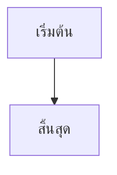
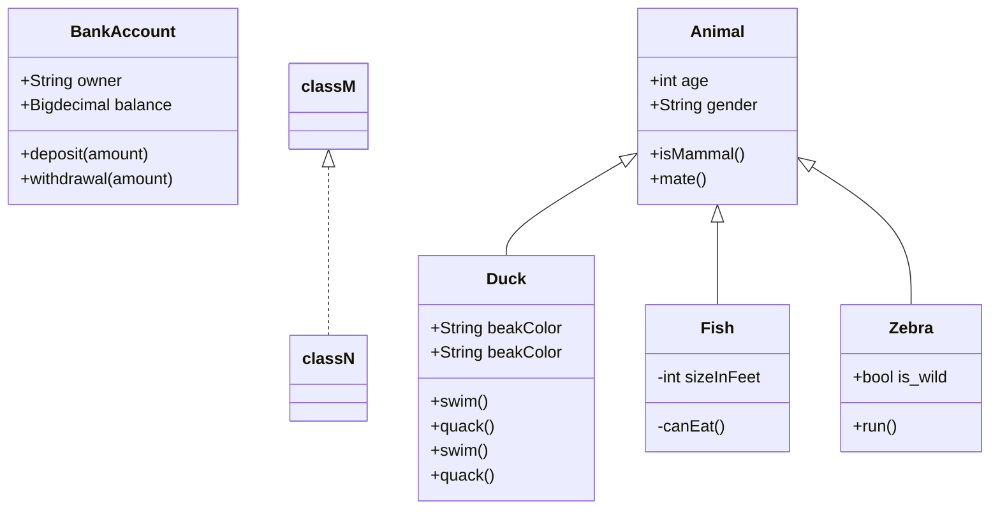

```mermaid
flowchart TD
Start[เริ่มต้น] --> Stop[สิ้นสุด]
```

```mermaid
classDiagram

class Duck{
            +String beakColor
            +swim()
            +quack()
        }

class BankAccount
        BankAccount : +String owner
        BankAccount : +Bigdecimal balance
        BankAccount : +deposit(amount)
        BankAccount : +withdrawal(amount)

 
 

classM <|.. classN
 
        Animal <|-- Duck
        Animal <|-- Fish
        Animal <|-- Zebra
        Animal : +int age
        Animal : +String gender
        Animal: +isMammal()
        Animal: +mate()
        class Duck{
            +String beakColor
            +swim()
            +quack()
        }
        class Fish{
            -int sizeInFeet
            -canEat()
        }
        class Zebra{
            +bool is_wild
            +run()
        }


```

